# Configuration

## Create an API Account

- Log in to the BigCommerce instance and go to *Advanced Settings → API Accounts*, click on the Create API Account CTA and select *Create V2/V3 API Token*

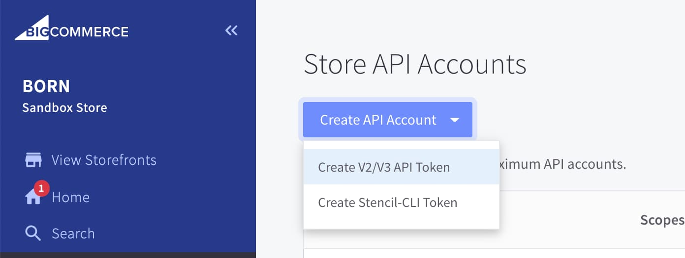

- Create a name for the API Account
- Copy the API Path
- Set all OAuth Scopes to (give full scope):
    - **Content** - Modify
    - **Checkout Content** Modify
    - **Customers** - Modify
    - **Customers Login** Login
    - **Information & Settings** - Modify
    - **Marketing** - Modify
    - **Orders** - Modify
    - **Order Transactions** Modify
    - **Create Payments** - Create
    - **Get Payment Methods** - Read-Only
    - **Stored Payment Instruments** - Modify
    - **Products** - Modify
    - **Themes** - Modify
    - **Carts** - Modify
    - **Checkouts** - Modify
    - **Sites & Routes** - Modify
    - **Channel Settings** - Modify
    - **Channel Listings** - Modify
    - **Storefront API Tokens** Manage
    - **Storefront API Customer Impersonation Tokens** - Manage
- Once the account has been created, a file containing the keys should automatically be downloaded, if it hasn’t take a note of the **Client ID**, **Client Secret**, and the **Access Token**

## Create a new BigCommerce App

- Go to [https://devtools.bigcommerce.com/my/apps](https://devtools.bigcommerce.com/my/apps) and login under your account
- Click on Create an app, set a name, e.g. VueStorefront, and close the pop up window
- You should see the app appear in the list, click on View Client ID and take note of the Client ID and the Client Secret

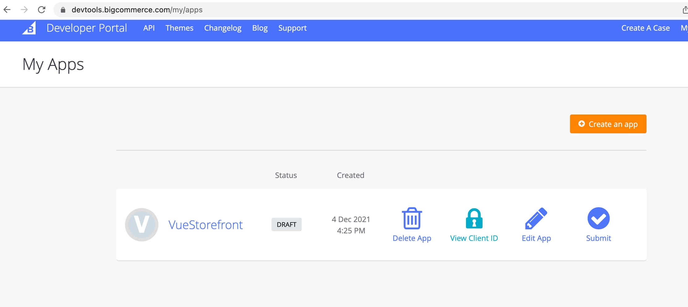

## Create a new Channel

> “A **channel** is anywhere a merchant sells their products. This encompasses headless storefronts, marketplaces, POS systems, and marketing platforms.” - Reference - [Channels - Management APIs - API Reference](https://developer.bigcommerce.com/api-reference/store-management/channels)
> 

The following steps will be referenced from the BigCommerce website. The steps can be done by sending **POST** request through the command line / Postman, or BigCommerce website itself.

- Open [Create a Channel - Channels - Channels - Management APIs - API Reference](https://developer.bigcommerce.com/api-reference/store-management/channels/channels/createchannel) and scroll down to Send a test Request.
- Populate the **store_hash** with your personal hash, this can be found as a part of the **API Path URL** from the previous step. e.g.: `https://api.bigcommerce.com/stores/noq5tdq0k6/v3/` (the part between /stores/ and /v3/)
- Populate **X-Auth-Token** with your BigCommerce API **Access Token** from the step above.

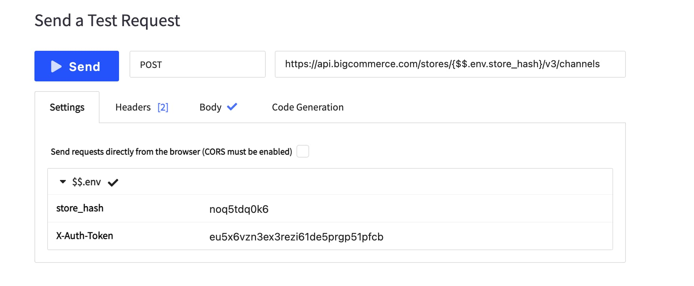

- Go to the **Body** section of the “Test Request” tool set the following payload

```json
{
  "name": "VueStorefront",
  "platform": "custom",
  "type": "storefront",
  "status": "active"
}
```

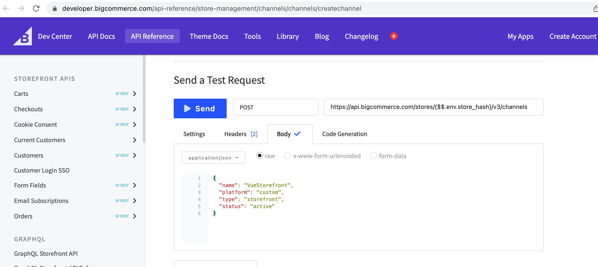)

The response will contain an `id` which we will be used as the `channel_id` in next requests, keep a note of it.

## Create a Channel Site

- Go to [Create a Channel Site - Channel Site - Channels - Management APIs - API Reference](https://developer.bigcommerce.com/api-reference/store-management/channels/channel-site/postchannelsite)
- Set the `channel_id` from the Create Channel response in Path Params

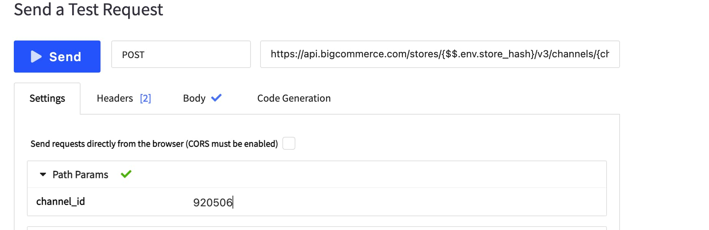

- Go to the Body tab and set the **url** as the link where the VueStorefront + BigCommerce app will be hosted, together with the channel_id from the previous step

```json
{
  "url": "http://myvuestorefrontbigcommerce.com",
  "channel_id": 920506
}
```

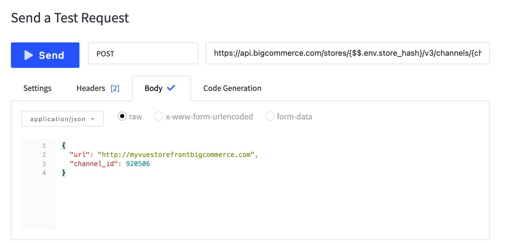

## Create a Route for the Cart

**To ensure “Edit Cart” Link in Embedded Checkout is not pointing to original storefront.**

- Open the BigCommerce admin panel
- Go to the **Channel Manager**
- Select the Channel you have just created and click on **Advanced Settings**
- Scroll down to Site details and copy the **Site ID**

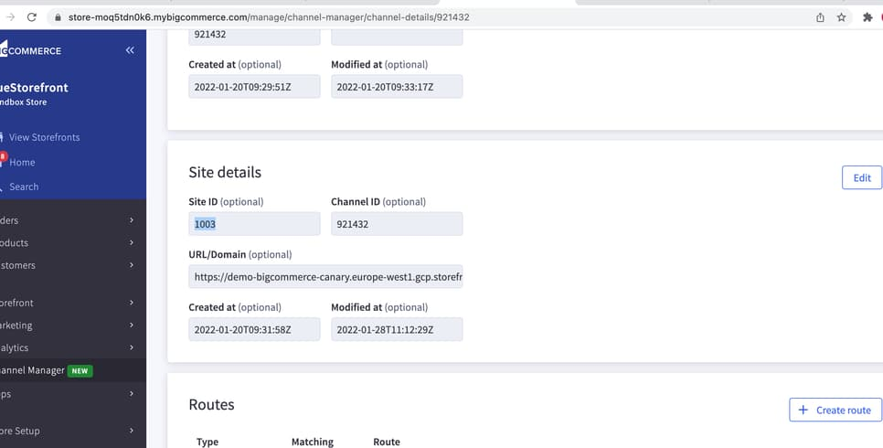

- Go to [Create a Site Route - Site Routes - Sites - Management APIs - API Reference](https://developer.bigcommerce.com/api-reference/store-management/sites/site-routes/post-site-route)
- Copy the **Site ID** in the Test Request Settings field

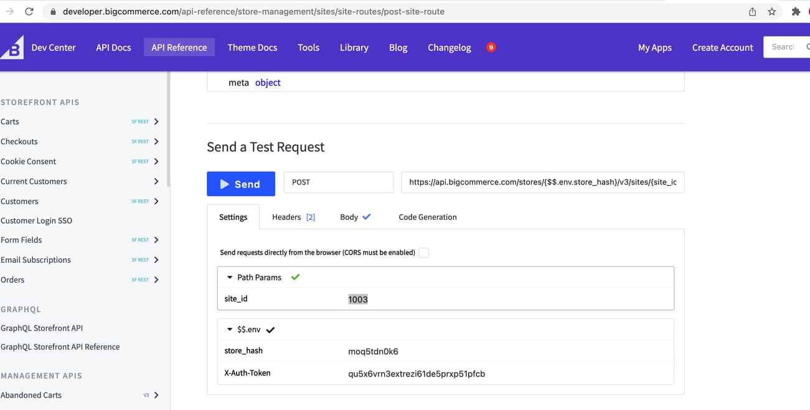

- Open the **Body** tab in Send Request and paste the following payload:

```json
{
  "type": "cart",
  "matching": "*",
  "route": "/"
}
```

- Once successful, repeat the operation with a different payload:

```json
{
  "type": "home",
  "matching": "*",
  "route": "/"
}
```

- Once successful, repeat the operation with a different payload again:

```json
{
  "type": "create_account",
  "matching": "*",
  "route": "/"
}
```

- Once successful, repeat the operation with a different payload once more:

```json
{
  "type": "forgot_password",
  "matching": "*",
  "route": "/"
}
```


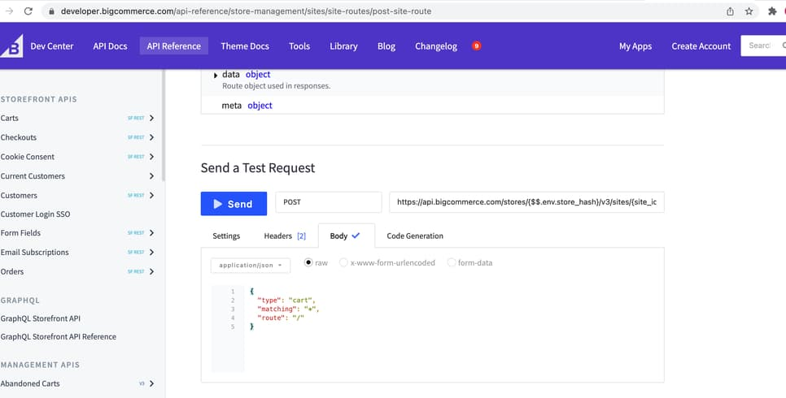

- Click on **Send**

__Please note that this step is important to alter those routes for ‘Edit Cart',  ‘Register’ and 'Create password’ links on checkout otherwise it will be pointing to the Default Store front of BigCommerce.__

The `route` can be changed for custom page later on if those pages will be created in the integration, currently `create_account` is in a modal and `forgot_password` is non existent.

_At the time of writing this guide (31/01/2021) it was not possible to create the route via admin panel, this might be fixed in the future by the BigCommerce team._

## Create a custom Cart ID field on Customers entity

- Login to your BigCommerce back office, and go to *Advanced Settings → Customer Sign Up Form*
- Click on *Create a New Field* and select *Text Field*

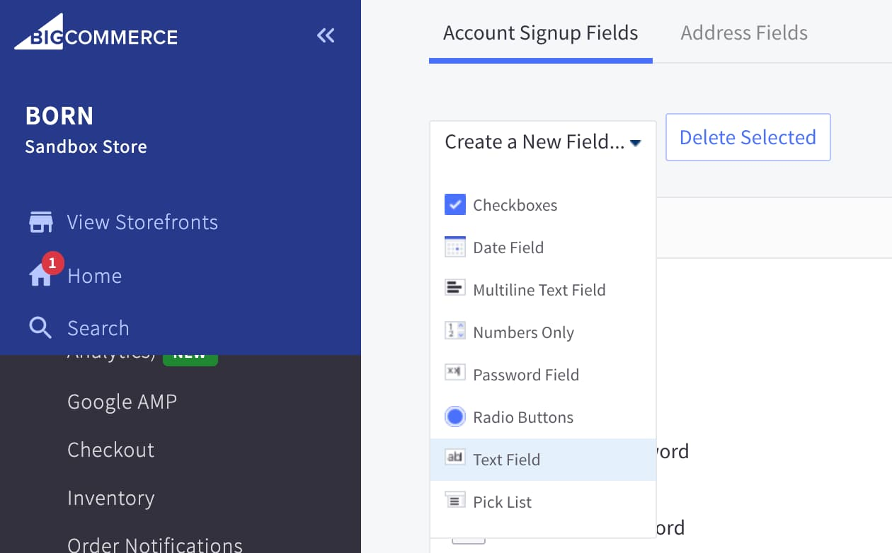

Set the Field name to: **Cart ID**

- Leave all other fields with the default values and press Save

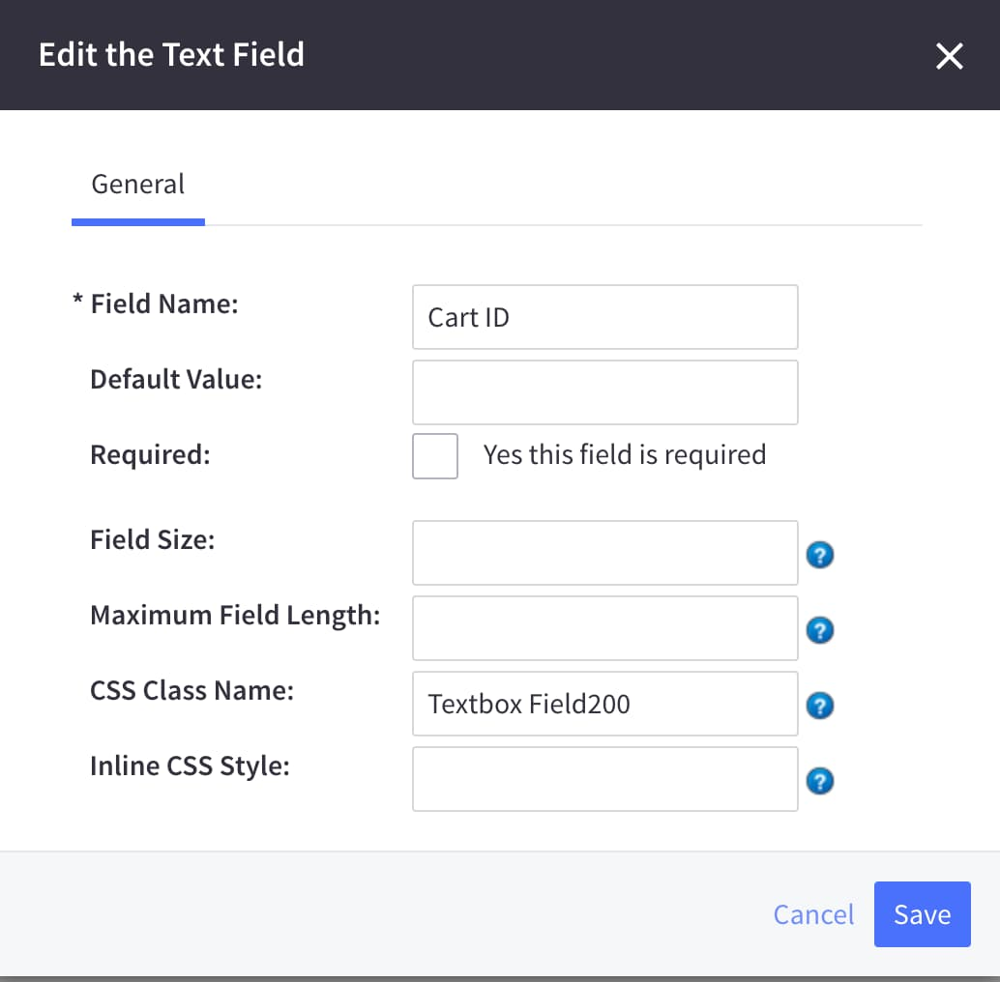

## Storefront URL and Guest Token

- Login to your BigCommerce back office, and go to the dashboard (main page).

### Storefront URL

- Click on ‘View Storefronts’ on the top of the left column, select the original BigCommerce storefront, and copy its URL. This URL by default will be in the following format **https://store-{store_hash}.mybigcommerce.com**

### Guest Token

- If your store isn’t published find the Review & Test your store tab, and copy the Guest Token, it will be needed in the environment variables
- If the store is published the guest token step might be ignored

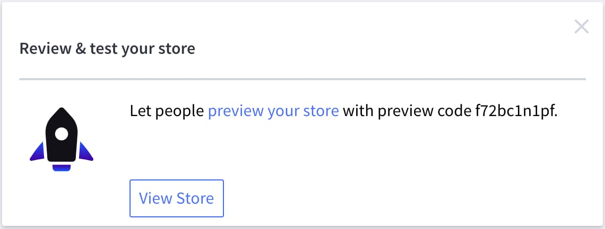

## Host BigCommerce Storefront on a subdomain

**Ensure that the BigCommerce Storefront is hosted on a subdomain of the application.**

Example:

[https://www.mystore.com](https://www.mystore.com/) -  VSF App

[https://bc.mystore.com](https://bc.mystore.com/) - BigCommerce Instance

This will be required to make the embedded checkout work.

BigCommerce prepared a guide how to change the domain of the store 

[BigCommerce Help Center](https://support.bigcommerce.com/s/article/Changing-Domains?language=en_US)

BigCommerce consultants suggests to create a CNAME pointing to BigCommerce instance. It should be hosted on the same server that the VSF app.

When the CNAME like [https://www.checkout.mystore.com](https://www.mystore.com/) is created, it can be added as a new domain. Navigate to **Server Settings → Domain name.** 

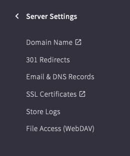

_Only the store owner can access the page and add a new domain._

Select **Add an existing** option.

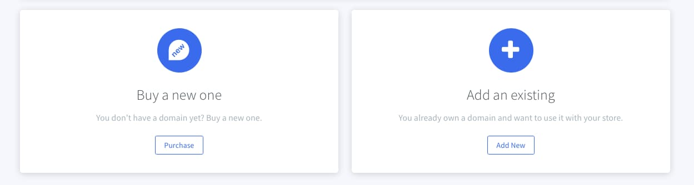

Enter domain name and extension.

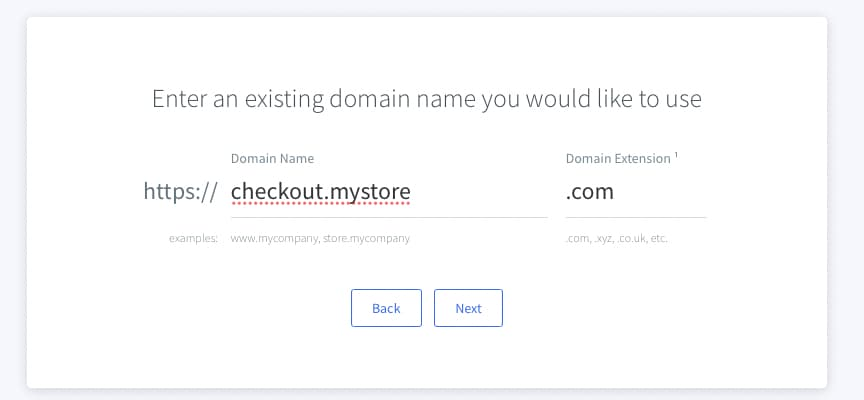

That’s all. Now the domain is added and BigCommerce store is available on this domain. BigCommerce should automatically add a SSL certificate. 

To check the status of SSL certificate navigate to **Server Settings → SSL Certificates**

_Only the store owner can access the page and manage SSL certificates._

## Additional changes
- It is possible to add more address or customer fields in BigCommerce, as well as making particular fields as ‘required’

- To add a new field - open the BigCommerce Admin panel

  1. Go to __Advanced Settings > Account Signup Form__

  2. Here you can select Account Signup Fields or Address Fields to create or amend the existing fields

  3. Please note that Address Fields will be reflected on the embedded checkout automatically

  4. Any new created or edited fields will need to be matched in one of the following components:

    - `packages/theme/components/MyAccount/ShippingAddressForm.vue` - for address fields

    - `packages/theme/components/LoginModal.vue` - for customer fields in the registration form

    - `packages/theme/components/MyAccount/ProfileUpdateForm.vue` - for customer fields in the update form

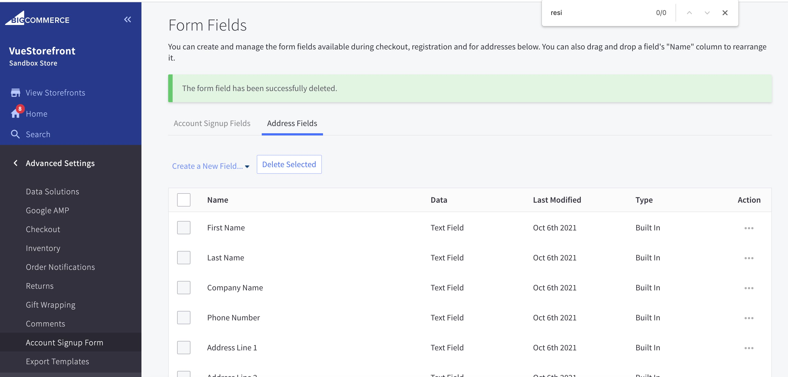

## Set up VueStorefront

The BigCommerce instance is now ready for VueStorefront! Let’s set up our codebase.

- Clone the repository: [GitHub - vuestorefront/bigcommerce](https://github.com/vuestorefront/bigcommerce)
- Rename **.env.example** to **.env** and change the file content with the following

```bash
BIGCOMMERCE_API_CLIENT_ID={API Client ID from Step 1 }
BIGCOMMERCE_API_CLIENT_SECRET={API Client Secret from Step 1 }
BIGCOMMERCE_API_URL={API URL from Step 1}
BIGCOMMERCE_API_ACCESS_TOKEN={Access Token from Step 1 }
BIGCOMMERCE_API_CLIENT_NAME=vsf-keys
BIGCOMMERCE_STORE_ID={ store_hash from Step 3 }
BIGCOMMERCE_CHANNEL_ID= { channel_id from the response in Step 3 }
BIGCOMMERCE_DEVTOOLS_APP_CLIENT_ID={ DevTools App Client ID from Step 2 }
BIGCOMMERCE_DEVTOOLS_APP_CLIENT_SECRET={ DevTools App Client Secret from Step 2 }
BIGCOMMERCE_STORE_URL={Storefront URL from Step 6 }
BIGCOMMERCE_STORE_GUEST_TOKEN={ Guest Token from Step 6 }
```
- open packages/theme/**themConfig**.ts and add your Channel ID from the response in Step 3 as a first item in the array
- Run **yarn** to install the dependencies
- Run **yarn build** to build the source files
- Run **yarn dev** to start the project.
- Your VueStorefront should be up and running connected to your BigCommerce instance.
- Please note that Channel ID is required in both .env file and themeConfig.js.